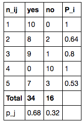
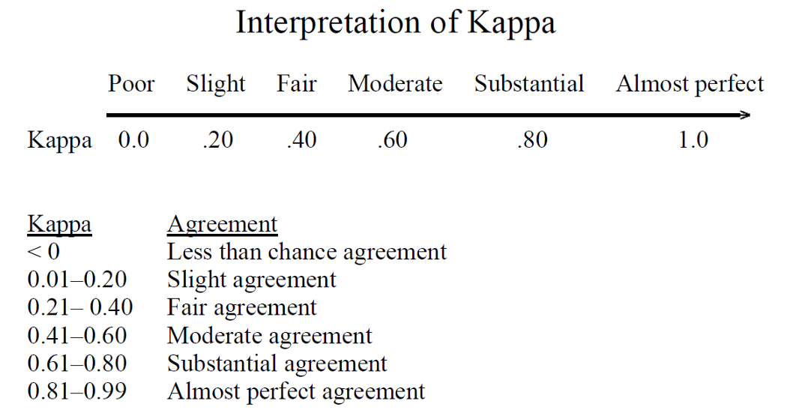

# EQUINOX
 


<br><br>

Equinox is a powerful and scalable Python library for calculating inter-annotator agreement scores for a variety of Natural Language Processing and Machine Learning tasks.

For example:
 - Fleiss's Kappa: A statistical measure for assessing the reliability of agreement between a fixed number of raters when assigning categorical ratings to a number of items or classifying items.

Many advanced ML tasks require annotating enormous amounts of data, which is a tedious and time-consuming task. Add on the time required to wrangle the data and compute inter-annotator agreement scores, and *poof*, weeks have gone by. We aim to answer the call for quicker annotation metrics Whether you are an academic, ML Engineer, or Citizen Data Scientist, Equinos is straightforward to install and our goal is to allow you to get to your NLP insights faster.

More funcionality is currently being built, and will be deployed upon completion. Stay tuned!

 # Installation
 Equinox can easily be installed via `pip`:
 ```
 pip install equinox
 ```

# How to Use Equinox
Equinox is very simple to use. See our documentation for more information. Below is an example to compute Fleiss's Kappa for > 2 annotators.
```
#Import
import equinox

#Define Input
entities = ["yes", "no"]
num_annotators = 10
df = pd.read_csv("annotated_data.csv") #See below

k = equinox.fleiss_kappa(entities, num_annotators, df)
## 0.53
```

Where:
 - `entities` A list of the names of entities annotated. These entity names must match the column names in `df`.
 - `num_annotators`: The number of annotators in the dataset.
 - `df`: Pandas DataFrame consiting of the number of annotations per entity (columns) for a finite number of documents (rows):

 

 # Interpretting Fleiss's Kappa Coefficients
 

 # Dependencies
 Equinox requires the following:
 - [Pandas](https://pandas.pydata.org/)

 # Running Tests
 Tests are written in the ``tests`` directory and processed using `PyTest <https://docs.pytest.org/en/latest/>`__.

 # Python Version
 Equinox supports `Python 3.6+ <https://python3statement.org/>`__ and, due to the use of unicode variable names/identifiers, is not compatible with Python 2.x. Given the small dependencies, Equinox may work on older versions of Python but this is beyond the scope of our support and we strongly recommend that you upgrade to the most recent version of Python.

